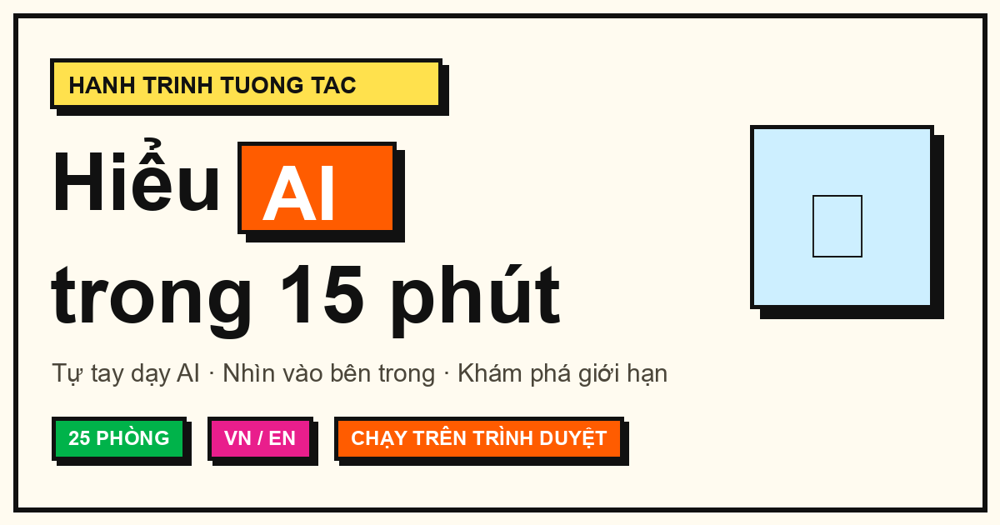

<p align="center">
  
</p>

<h1 align="center">🧠 AI Explorer — Hiểu AI trong 15 phút</h1>

<p align="center">
  <b><a href="https://tridpt.github.io/ai-explorer/">🚀 Dùng thử ngay »</a></b>
</p>

<p align="center">
  
  
  
  
</p>

Một "bảo tàng AI tương tác" chạy **hoàn toàn trên trình duyệt** — không cần server backend,
không cần API key. Bạn đi qua 25 "phòng", mỗi phòng giải thích trực quan một khái niệm cốt lõi
về AI và cho **tự tay nghịch**: dạy AI qua webcam, huấn luyện mạng nơ-ron, xem AI tạo ảnh,
trò chuyện với chatbot mini, cho AI tra tài liệu (RAG), xem agent tự gọi công cụ... Song ngữ
Việt–Anh, cài được như app, chạy cả khi offline.

> 🌐 **Bản song ngữ:** bấm nút **EN/VI** ở góc trên bên phải để đổi ngôn ngữ bất cứ lúc nào.

> 🧭 **Chọn lộ trình:** ngay ở trang chủ, chọn *Người mới* (5 phòng cốt lõi), *Đầy đủ*, hoặc
> *Cho lập trình viên* (token, embeddings, RAG, fine-tuning, agents…) để không bị choáng.

> 🔍 **Tìm nhanh:** bấm phím `/` (hoặc nút 🔍) để mở ô tìm và nhảy thẳng tới bất kỳ phòng nào.

> ✅ **Kiểm tra hiểu bài:** mỗi phòng có một câu hỏi nhỏ, trả lời đúng sẽ cộng dồn vào điểm hành trình.

## Hành trình

| # | Phòng | Câu hỏi trả lời |
|---|-------|-----------------|
| 01 | 📸 Tự tay dạy AI | AI học như thế nào? (webcam, dạy bằng ví dụ) |
| 02 | 🕸️ Bên trong mạng nơ-ron | Bên trong AI là gì? (mạng nơ-ron huấn luyện trực tiếp) |
| 03 | 🎯 Học vẹt hay hiểu thật? | Overfitting — AI nhớ bài cũ nhưng làm sai bài mới |
| 04 | 🌳 Cây quyết định | Loại AI minh bạch, nhìn thấy được từng luật |
| 05 | 🤖 Học qua thử và sai | Reinforcement learning — robot học bằng thưởng/phạt |
| 06 | 🧲 Tự phân nhóm | Unsupervised — AI tự gom nhóm không cần nhãn |
| 07 | ✂️ Token là gì | AI đọc chữ kiểu gì? (cắt token + chi phí) |
| 08 | 🗺️ Bản đồ ý nghĩa | AI hiểu nghĩa từ ra sao? (vua − đàn ông + đàn bà = nữ hoàng) |
| 09 | 👁️ AI đọc câu của bạn | Cơ chế attention — "nó" trỏ về đâu? |
| 10 | 🎲 Máy đoán chữ | Vì sao AI đôi khi đoán bừa? (hallucination) |
| 11 | 🎨 AI tạo ảnh thế nào | Diffusion — từ nhiễu thành ảnh rõ dần |
| 12 | 📺 Vì sao app hiểu bạn | Gợi ý — cơ chế sau TikTok/YouTube/Netflix |
| 13 | ⚖️ AI có thiên kiến? | AI học cả định kiến từ dữ liệu |
| 14 | 🐺 Đánh lừa AI | Adversarial — nhiễu vô hình khiến AI nhìn sai |
| 15 | 🕵️ Người hay AI viết? | Rèn con mắt phân biệt văn người / AI |
| 16 | 💬 Chatbot mini | Ghép tất cả khái niệm lại thành một trợ lý |
| 17 | 🔧 AI tra cứu tài liệu | RAG — vì sao chatbot đọc được tài liệu riêng |
| 18 | 🧩 Dạy thêm cho AI | Prompting vs Fine-tuning — chọn cách nào? |
| 19 | 🤝 AI biết dùng công cụ | Agents — AI tự lên kế hoạch, gọi công cụ nhiều bước |
| 20 | 🖼️ AI hiểu cả ảnh lẫn chữ | Multimodal — ảnh + chữ trong cùng không gian nghĩa |
| 21 | 🪟 Cửa sổ ngữ cảnh | Vì sao AI "quên" đầu câu chuyện? (context window) |
| 22 | 🛡️ Đánh lừa AI bằng lời | Prompt injection — vì sao "câu lệnh lén" lừa được AI |
| 23 | 👍 Dạy AI cư xử cho phải | RLHF — con người chấm điểm, AI học trả lời hữu ích & tử tế |
| 24 | ⚡ AI ngốn bao nhiêu điện? | Chi phí năng lượng của AI — nhỏ mỗi lượt, lớn khi nhân triệu người |
| 25 | 🎓 Tổng kết | Quiz + huy hiệu hoàn thành |

## Cách chạy

Dự án dùng ES modules nên cần chạy qua một HTTP server cục bộ (không mở trực tiếp file).

**Cách 1 — Python (có sẵn trên hầu hết máy):**
```
cd d:\AI_App\ai-explorer
python -m http.server 8000
```
Rồi mở http://localhost:8000

**Cách 2 — VS Code:** cài extension "Live Server", bấm chuột phải vào `index.html` → "Open with Live Server".

> Lưu ý: phòng 01 (webcam) cần quyền camera và phải chạy qua `localhost` hoặc HTTPS — đây là yêu cầu bảo mật của trình duyệt.

## Cấu trúc

```
ai-explorer/
├── index.html          # Khung trang + meta chia sẻ + favicon
├── style.css           # Toàn bộ giao diện (Neo-brutalism: Archivo + Space Mono, viền dày + bóng cứng)
├── app.js              # Router + điều hướng + tiến trình + toolbar + tìm phòng + chia sẻ + i18n
├── roomstate.js        # Deep-link: đọc/ghi trạng thái phòng vào query của URL
├── roomquiz.js         # Ngân hàng câu hỏi nhỏ + chèn quiz "kiểm tra hiểu bài" ở mỗi phòng
├── tracks.js           # Định nghĩa các lộ trình học (Người mới / Đầy đủ / Cho lập trình viên)
├── i18n.js             # Song ngữ VN/EN
├── analytics.js        # Thống kê ẩn danh (GoatCounter, tùy chọn)
├── sound.js            # Âm thanh Web Audio + hiệu ứng confetti
├── store.js            # Lưu tiến trình, điểm quiz, câu đã đúng & lộ trình vào localStorage
├── pwa.js              # Đăng ký service worker + nút cài app + thông báo "có bản mới"
├── sw.js               # Service worker: cache offline (danh sách ASSETS + số phiên bản CACHE)
├── manifest.json       # Khai báo PWA (tên, icon, màu chủ đề)
├── robots.txt          # Cho phép crawl + trỏ tới sitemap
├── sitemap.xml         # Sitemap cho SEO
├── rooms/              # Mỗi phòng là một module độc lập
│   ├── home.js         # Trang chủ + chọn lộ trình + tiến trình + nút tiếp tục
│   ├── teachable.js    # Webcam KNN (thuần JS)
│   ├── neural-net.js   # MLP 2→H→1 huấn luyện trên trình duyệt
│   ├── overfitting.js  # Học vẹt vs hiểu thật (train vs test)
│   ├── decision-tree.js# Cây quyết định tương tác
│   ├── reinforcement.js# Học tăng cường: robot học đường tới đích qua thưởng/phạt
│   ├── clustering.js   # Học không giám sát: k-means tự gom nhóm
│   ├── tokenizer.js    # Cắt token + đếm chi phí
│   ├── embeddings.js   # Bản đồ từ + phép loại suy
│   ├── attention.js    # Trực quan hóa attention
│   ├── next-token.js   # Mô hình bigram/trigram sinh chữ
│   ├── diffusion.js    # Mô phỏng tạo ảnh từ nhiễu
│   ├── recommendation.js # Hệ gợi ý: thích/bỏ qua → đoán gu (TikTok/Netflix)
│   ├── bias.js         # Liên tưởng giới tính theo nghề
│   ├── adversarial.js  # Nhiễu vô hình khiến AI nhìn sai (adversarial)
│   ├── turing.js       # Người hay AI viết? — rèn con mắt phân biệt
│   ├── chatbot.js      # Chatbot mini + pipeline trực quan
│   ├── rag.js          # RAG: tra kho tài liệu rồi trả lời có dẫn nguồn
│   ├── finetune.js     # Prompting vs Fine-tuning: so sánh + quiz tình huống
│   ├── agents.js       # AI agent: vòng lặp suy nghĩ → gọi công cụ → trả lời
│   ├── multimodal.js   # AI hiểu ảnh + chữ: nhãn, mô tả, hỏi–đáp về ảnh
│   ├── context-window.js # Cửa sổ ngữ cảnh: token cũ rơi ra → AI "quên"
│   ├── prompt-injection.js # Prompt injection & an toàn: câu lệnh lén lừa AI, bật/tắt phòng thủ
│   ├── rlhf.js         # RLHF: con người chấm điểm → mô hình thưởng → AI học cư xử
│   ├── energy.js       # Vì sao AI tốn điện: chạy tác vụ, quy đổi năng lượng, nhân quy mô
│   └── summary.js      # Tổng kết + quiz + huy hiệu + chia sẻ
└── data/
    └── embeddings.js   # Vector 2D tính sẵn cho các từ
```

## Tính năng

- 25 phòng tương tác, mỗi phòng một tông màu chủ đề.
- Giao diện Neo-brutalism (viền đen dày, bóng cứng, khối màu rực).
- **Lộ trình học theo cấp độ**: chọn *Người mới* (5 phòng cốt lõi), *Đầy đủ*, hay *Cho lập trình viên* — không bị choáng với hơn 20 phòng.
- **Quiz nhỏ rải rác** ở cuối mỗi phòng ("kiểm tra hiểu bài"), cộng dồn vào điểm hành trình.
- Âm thanh phản hồi (bật/tắt được) + confetti khi hoàn thành quiz.
- Quiz tổng kết + huy hiệu theo cấp, tải được thành ảnh PNG để khoe.
- Chế độ trình chiếu toàn màn hình, điều hướng bằng phím ←/→.
- **Tìm nhanh phòng**: bấm 🔍 hoặc phím `/` để tra theo tên/khái niệm (token, attention, gợi ý…) và nhảy thẳng tới phòng. Ô tìm có bẫy focus (Tab/Shift+Tab quẩn trong hộp thoại) và trả focus về nút mở khi đóng.
- **Deep-link theo trạng thái**: một số phòng mã hóa trạng thái vào URL (câu ở Tokenizer/Attention, prompt ở Diffusion) để chia sẻ đúng một demo cụ thể.
- **Nút "Chia sẻ"** trên mỗi phòng: dùng Web Share API trên điện thoại, tự copy link (kèm trạng thái) khi trên desktop.
- Gợi ý onboarding cho từng phòng.
- Ghi nhớ tiến trình & điểm cao nhất qua localStorage.
- Tối ưu cho cả điện thoại.
- **PWA**: cài được như app, chạy offline (service worker cache toàn bộ asset). Khi có bản mới, app hiện thông báo **"Đã có bản mới — Tải lại"** thay vì kẹt ở bản cũ.
- Tôn trọng tùy chọn "giảm chuyển động" của hệ điều hành (accessibility).
- Mục "Tìm hiểu thêm" với các nguồn học AI trực quan uy tín.

## Tạo lại icon

Icon PWA được sinh bằng script:
```
python gen_icons.py
```

## Mở rộng thêm phòng mới

Kiến trúc module hóa: chỉ cần tạo `rooms/ten-phong.js` export một hàm `render(root)`,
rồi thêm một mục vào mảng `ROOMS` trong `app.js`. Khung sườn (tiêu đề, điều hướng, thanh tiến trình)
được xử lý tự động.

## Kiểm thử

Hai lớp kiểm tra chạy tự động trên GitHub Actions (job `test` trong
`.github/workflows/deploy.yml`) trước mỗi lần deploy — nếu lỗi, quá trình deploy bị chặn.

**1. Kiểm tra toàn vẹn cache offline** (`tests/check-assets.mjs`) — nhanh, không cần
browser/server. Đảm bảo mọi module `.js`, `index.html`, `style.css` và mọi icon khai báo
trong `manifest.json` đều có mặt trong mảng `ASSETS` của `sw.js`. Nhờ vậy khi thêm file mới
mà quên cache, CI báo lỗi ngay thay vì offline hỏng âm thầm.

```
npm run check-assets
```

**2. Smoke test** (`tests/smoke.mjs`) — mở app bằng Chromium (Playwright), duyệt qua **tất cả
các phòng** và fail nếu có bất kỳ lỗi console / exception nào. Danh sách phòng được đọc trực
tiếp từ mảng `ROOMS` trong `app.js`, nên phòng mới thêm sau này được kiểm tra tự động.

```
npm install
npx playwright install chromium
npm run serve      # cửa sổ 1: chạy server tại http://localhost:8000
npm test           # cửa sổ 2: chạy smoke test
```
